# 📊 Financial Market Analytics
---
>  [Cliquez ici pour voir direct le Dashboard interactif](https://financial-market-analysis-hhw3etpxsawaeqfjhxbmp9.streamlit.app/)   [](https://financial-market-analysis-hhw3etpxsawaeqfjhxbmp9.streamlit.app/)
---
<p align="center">
  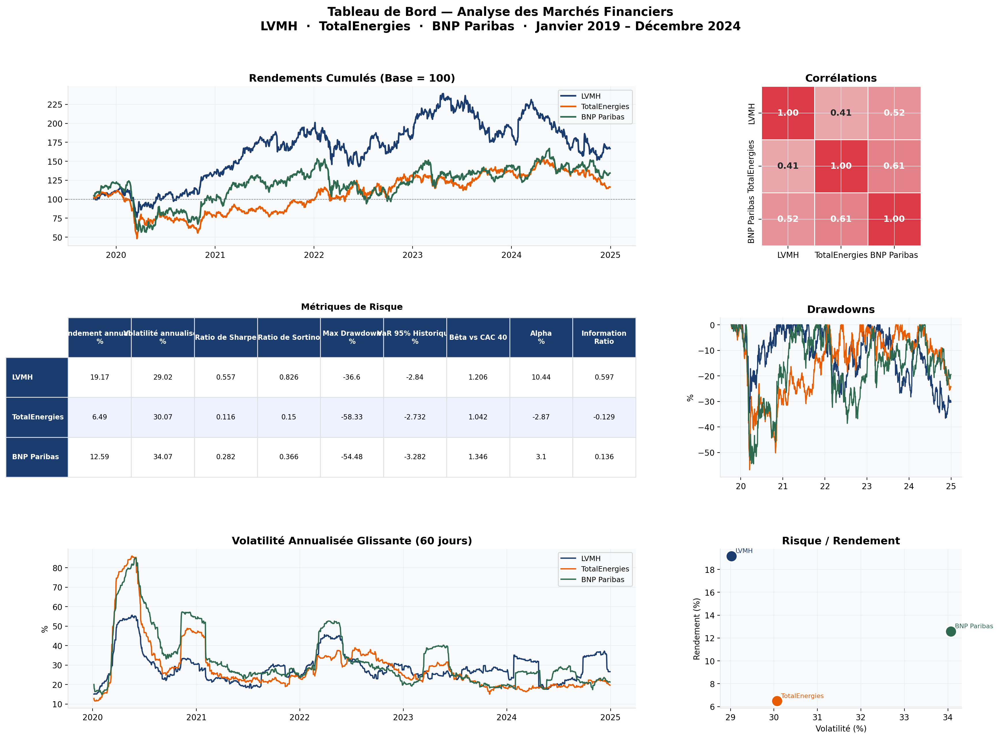
</p>

<p align="center">
  


  

</p>

---

---

##  Problématique

> **Comment un investisseur institutionnel de long terme peut-il construire un portefeuille actions résistant aux crises systémiques, en optimisant le couple rendement/risque selon la théorie moderne du portefeuille ?**

Ce projet analyse **6 ans de données de marché** (2019–2024) sur trois piliers du CAC 40 représentant trois secteurs distincts : le luxe, l'énergie et la finance. Il mobilise les outils standards des desks de gestion quantitative : VaR, CVaR, optimisation de Markowitz, stress testing et simulation Monte Carlo.

---

## 📈 Résultats clés

| Métrique | LVMH | TotalEnergies | BNP Paribas |
|---|---|---|---|
| Rendement annualisé | **+19.2%** | +6.5% | +12.6% |
| Volatilité annualisée | 29.0% | 30.1% | 34.1% |
| Ratio de Sharpe | **0.557** | 0.116 | 0.282 |
| Alpha vs CAC 40 | **+10.4%** | -2.9% | +3.1% |
| Information Ratio | **0.597** | -0.129 | 0.136 |
| Max Drawdown | -36.6% | -58.3% | -54.5% |
| Bêta vs CAC 40 | 1.21 | 1.04 | 1.35 |

>  **Insight clé :** LVMH est le seul actif affichant un Alpha significatif (+10.4%) et un Information Ratio supérieur au seuil institutionnel de 0.5. TotalEnergies génère un Alpha **négatif** — son intérêt est uniquement la diversification (corrélation de 0.41 avec LVMH).

---

##  Portefeuille Optimal

```
Répartition Max Sharpe
─────────────────────────────────────────
  LVMH           ████████████████  60.0%
  BNP Paribas    ████████████      35.0%
  TotalEnergies  █                  5.0%
─────────────────────────────────────────
  Rendement      16.2%
  Volatilité     26.6%
  Sharpe         0.498
```

---

##  Stress Testing — Résistance aux crises

| Scénario | Durée | Performance |
|---|---|---|
| - Krach COVID (fév–mars 2020) | 24 jours | **-36.0%** |
| + Rebond COVID (mars–août 2020) | 104 jours | **+27.9%** |
| - Crise inflation / taux (2022) | 201 jours | **-18.3%** |
| - Crise bancaire SVB (mars 2023) | 15 jours | **-8.7%** |

---

##  Simulation Monte Carlo — 10 000 scénarios / 1 an

<p align="center">
  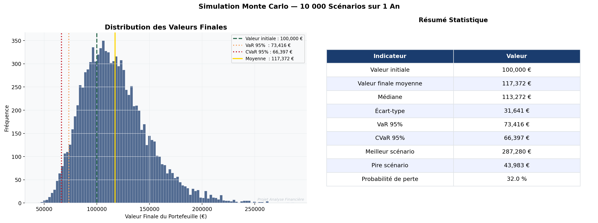
</p>

| Indicateur | Valeur |
|---|---|
| Valeur initiale | 100 000 € |
| Valeur finale moyenne | **117 372 €** |
| Médiane | 113 272 € |
| VaR 95% | 73 416 € |
| CVaR 95% | 66 397 € |
| Probabilité de perte | 32.0% |

---

##  Architecture

```
financial-market-analysis/

│
├── app.py                # Dashboard Streamlit interactif
├── src/
│   ├── data_loader.py    # Téléchargement via yfinance
│   ├── preprocessing.py  # Nettoyage et calcul des rendements
│   ├── indicators.py     # RSI, MACD, Bollinger, moyennes mobiles
│   ├── risk_analysis.py  # VaR, CVaR, Sharpe, Markowitz, Monte Carlo
│   └── visualization.py  # 14 graphiques pro
│
├── data/
│   ├── raw/              # Données brutes yfinance
│   ├── processed/        # Données nettoyées
│   └── risk/             # Métriques de risque et optimisation
│
├── outputs/figures/      # 14 graphiques générés automatiquement
├── requirements.txt
└── README.md
```

---

##  Méthodologie complète

<details>
<summary><b>1. Analyse technique (cliquer pour développer)</b></summary>

- Moyennes mobiles **MA20 / MA50 / MA200**
- **RSI** (14 jours) — détection de surachat/survente
- **MACD** — croisements haussiers/baissiers
- **Bandes de Bollinger** — mesure de la volatilité relative
- Génération de **signaux agrégés** (-3 à +3)

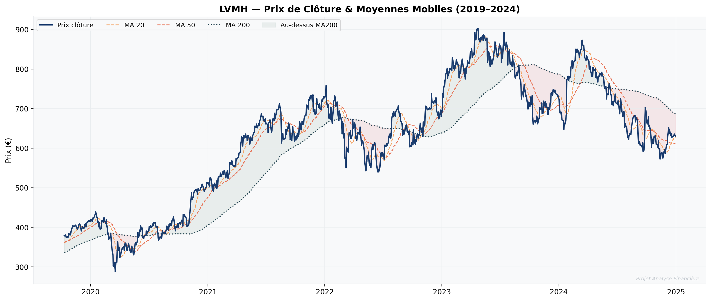

</details>

<details>
<summary><b>2. Mesure du risque (cliquer pour développer)</b></summary>

- **VaR historique & paramétrique** à 95% et 99%
- **CVaR / Expected Shortfall** — mesure imposée par Bâle III
- **Maximum Drawdown** avec date et durée de récupération
- **Bêta vs CAC 40** — sensibilité systémique

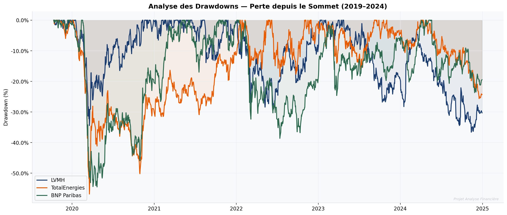

</details>

<details>
<summary><b>3. Benchmark institutionnel (cliquer pour développer)</b></summary>

- **Alpha de Jensen** — surperformance nette vs CAC 40
- **Tracking Error** annualisée
- **Information Ratio** (seuil institutionnel : > 0.5)

</details>

<details>
<summary><b>4. Optimisation de Markowitz (cliquer pour développer)</b></summary>

- **Frontière Efficiente** (100 portefeuilles optimaux)
- Portefeuille **Maximum Sharpe** (optimal risque/rendement)
- Portefeuille **Minimum Variance** (plus conservateur)
- **Risk Budgeting** — contribution au risque par action

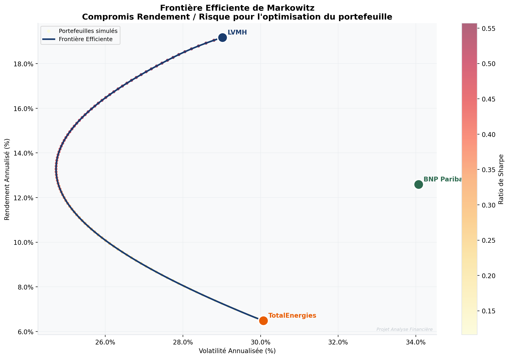

</details>

---

## 📊 Galerie des graphiques

| | |
|---|---|
| 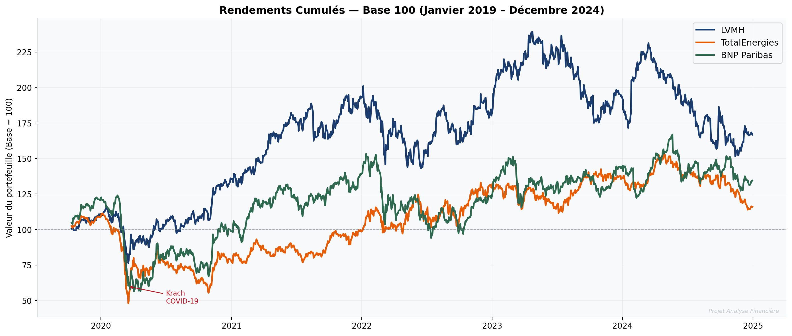 | 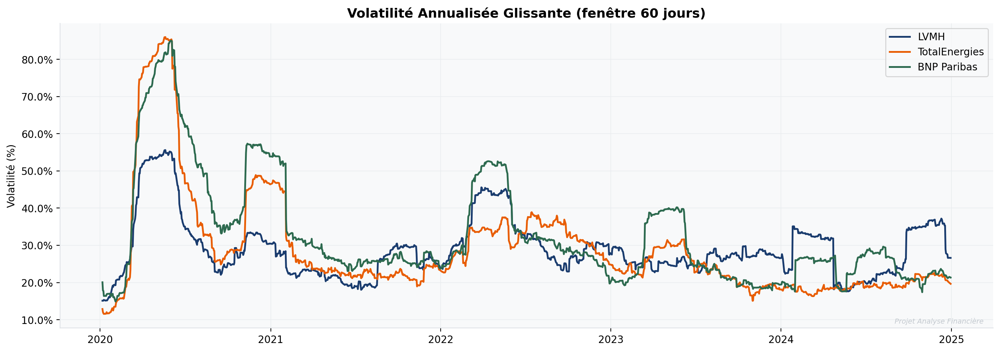 |
| 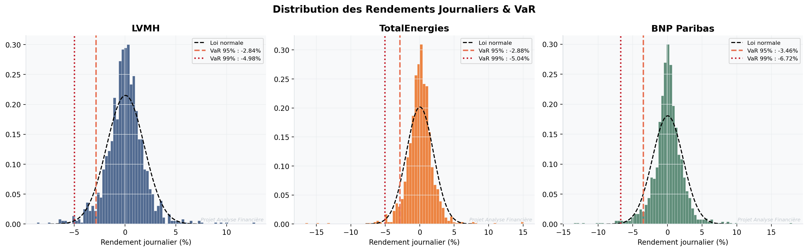 | 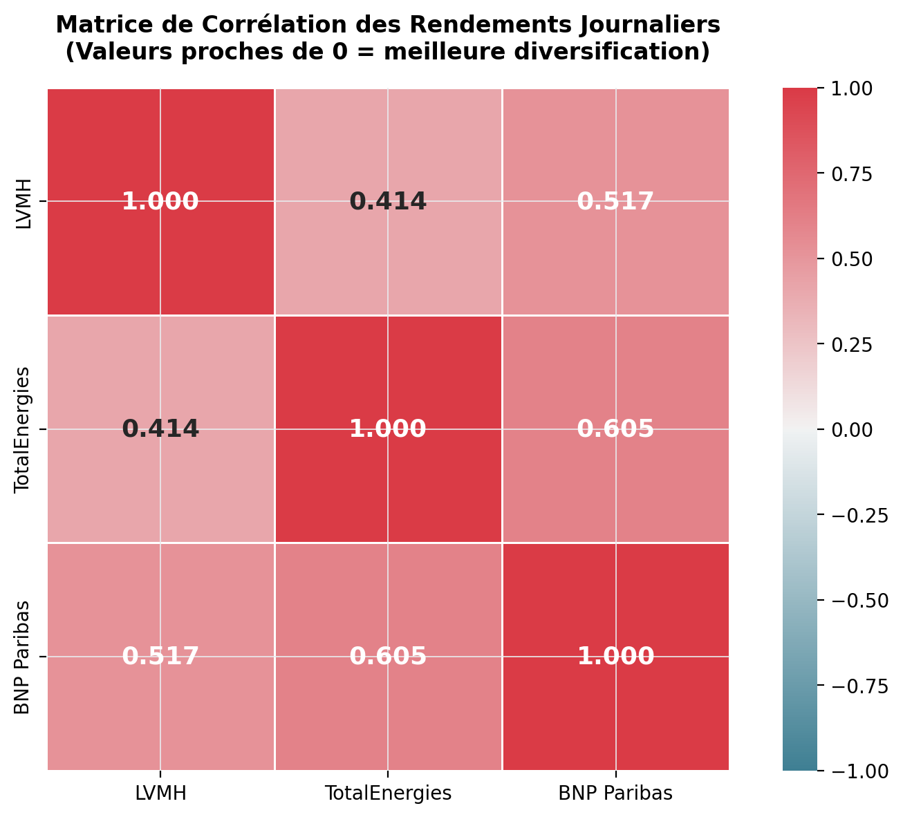 |
| 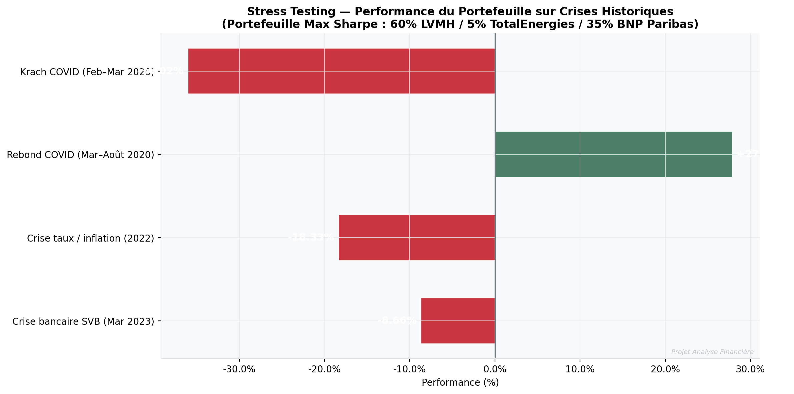 | 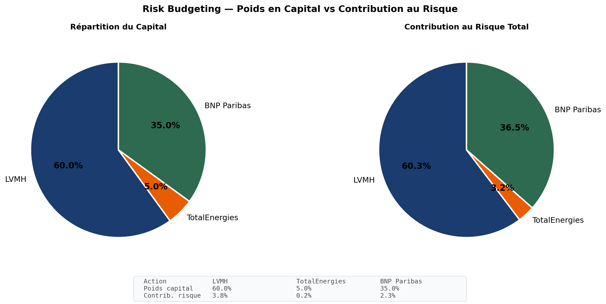 |

---

##  Stack technique

| Catégorie | Outils |
|---|---|
| **Interface Web** | `Streamlit` (Déploiement Cloud) |
| **Données marché** | `yfinance` · `pandas` |
| **Calcul quantitatif** | `NumPy` · `SciPy` |
| **Optimisation** | `scipy.optimize` (SLSQP) |
| **Visualisation** | `matplotlib` · `seaborn` · `Plotly` (interactif) |
| **Environnement** | Python 3.11 · Git |

---
##  Installation & Lancement

```bash
# 1. Cloner le projet
git clone [https://github.com/votre-username/votre-repo.git](https://github.com/votre-username/votre-repo.git)

# 2. Installer les dépendances
pip install -r requirements.txt

# 3. Lancer le Dashboard interactif
streamlit run app.py

```

---


##  Auteur

**Bellaghma Imene**  


[](https://linkedin.com/in/bellaghma-imene-74b081294)

---

